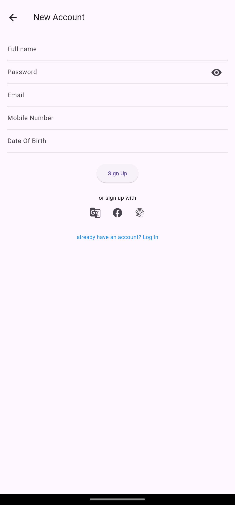
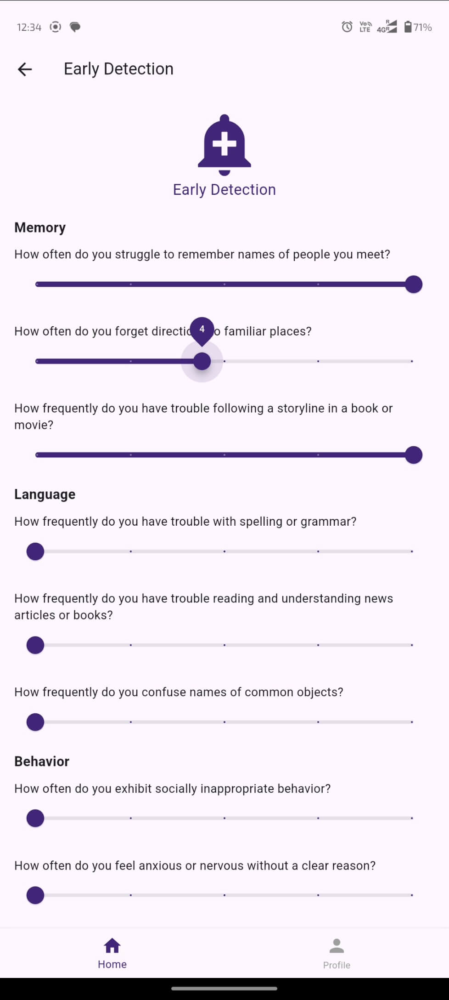

# Welcome, we are grey-matter-gurus, team participated in 2024 TDI Global Hackathon

# Dementia Care Management App

## Overview
This app is designed to assist caregivers and individuals in early detection of dementia-related symptoms and to manage care effectively. It provides tools for monitoring cognitive health, accessing learning resources, and connecting with support networks.

## Features

### User Authentication
- **Sign Up:** Allows new users to create an account by providing their full name, email, password, mobile number, and date of birth.
- **Login:** Enables returning users to log in with their email and password.

### Home Screen
- **Categories Section:** Provides quick access to favorite features, doctors, location services, daily notes, and patient records.
- **Upcoming Schedule:** Displays a user's upcoming appointments with healthcare providers, allowing them to see the date, time, and doctor’s name.
- **Quick Access Buttons:** Offers buttons for Early Detection, Learning Center, Nurse Assist, and Community features.

### Early Detection
- **Questionnaire:** Users can rate their symptoms across different categories such as Memory, Language, Behavior, and Problem Solving. Each category contains a set of questions rated on a scale of 1 to 5 using sliders.
- **Submit Ratings:** Users can submit their ratings, which are then summed up by category and sent to a backend API for further analysis and processing.

### Learning Center
- **News and FAQ:** Users can access articles, tips, and FAQs related to dementia care and prevention. This section helps caregivers stay informed about the latest research and best practices.

### Support Features
- **Nurse Assist:** Provides direct access to nurse support for medical advice and assistance.
- **Community:** Connects users with a community of caregivers and individuals dealing with dementia for mutual support and information sharing.

### User Profile
- **Profile Management:** Users can view and manage their profile information.
- **Notifications:** Users receive notifications about important updates, reminders for appointments, and new content in the Learning Center.

## Design Highlights
- **User-Friendly Interface:** The app features a clean and intuitive design with clear navigation and easy-to-use controls.
- **Consistent Theme:** Uses a consistent color theme (Hex #402579) throughout the app for buttons, headers, and other UI elements to ensure a cohesive look and feel.
- **Responsive Design:** Ensures that the app is accessible and functions well on various devices.

## Target Audience
- **Caregivers:** Individuals who provide care for dementia patients and need tools to monitor and manage their health.
- **Patients:** Individuals at risk of or diagnosed with dementia who need to track their symptoms and access resources.

## Demo / Samples

#### Home Page


#### Login Page


#### SignUp Page


#### Dashboard


#### Early Detect


#### List Doctors


## Setup Instructions

### Prerequisites
- Flutter SDK
- Dart SDK

### Installation

1. **Clone the repository:**
    ```sh
    git clone https://github.com/your-username/dementia-care-app.git
    cd we_care
    ```

2. **Install dependencies:**
    ```sh
    flutter pub get
    ```

3. **Run the app:**
    ```sh
    flutter run
    ```

## Contributing
Contributions are welcome! Please fork the repository and submit a pull request for review.

## License
This project is licensed under the MIT License - see the [LICENSE](LICENSE) file for details.